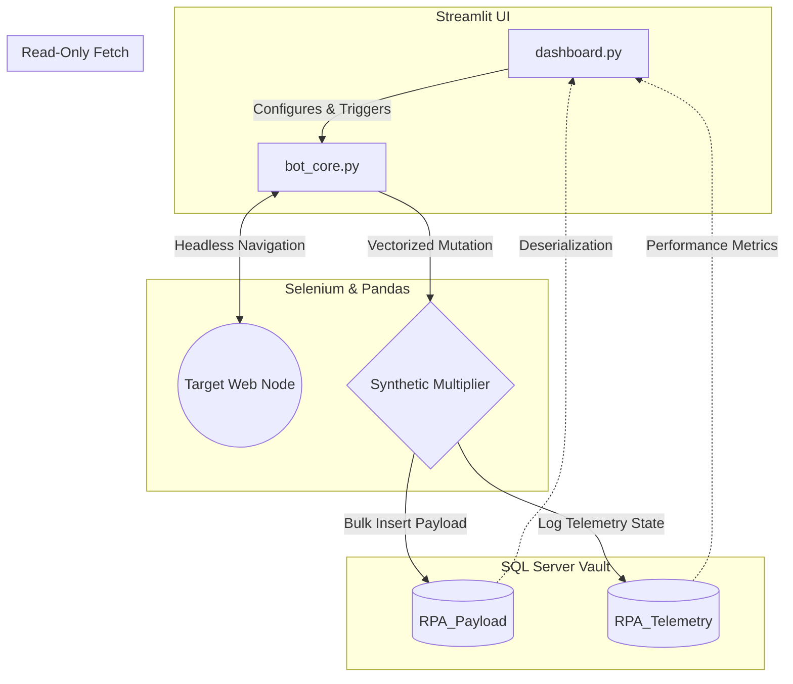

# **Back-Office RPA Telemetry Engine**

> **Enterprise-Grade Robotic Process Automation (RPA) Pipeline: Headless web extraction, concurrent DOM parsing, synthetic volume orchestration, and transactional SQL Server telemetry.**


---

## **1. EXECUTIVE SUMMARY**
The **Back-Office-RPA-Telemetry-Engine** is a production-grade Robotic Process Automation (RPA) solution designed to eliminate manual data entry overhead while maintaining strict data governance. Bypassing fragile local file systems (I/O bottlenecks), this engine utilizes a headless Selenium WebDriver to autonomously parse dynamic DOM nodes, applies in-memory vectorization, and directly injects structured payloads into a Microsoft SQL Server database using optimized bulk inserts.

## **2. BUSINESS LOGIC & OPERATIONAL ROI**
Manual web extraction carries hidden costs: human error, high labor overhead, and unacceptable latency. This automated engine provides:
* **Frictionless Scalability:** Capable of scraping paginated targets unattended in headless mode.
* **100% Observability:** Every execution (whether successful or failed) is permanently logged in a relational database with millisecond-precision timestamps and volume metrics.
* **SSOT Enforcement (Single Source of Truth):** Data is injected directly into SQL databases. No local `.csv` or `.xlsx` files are ever generated, completely neutralizing the risk of local data leakage.

## **3. HYBRID ARCHITECTURE & STRESS TESTING**
To demonstrate both precise DOM parsing and massive database injection capabilities without bottlenecking hardware resources, this pipeline utilizes a **Hybrid Extraction** approach:
1. **Precision Web Scraping:** The bot navigates the target site, applying explicit wait strategies to extract physical HTML nodes safely.
2. **In-Memory Synthetic Multiplication:** Leveraging Pandas, the engine takes the cleanly extracted baseline data and dynamically multiplies it into massive synthetic volumes (e.g., 100,000+ records) in milliseconds.
3. **Transactional Bulk Insert:** The massive payload is injected directly into SQL Server via SQLAlchemy, proving the engine's capability to handle high-throughput corporate data loads.

## **4. SYSTEM ARCHITECTURE DIAGRAM**
The system strictly decouples the UI (Control Layer), the Web Driver (Automation Layer), and the Database (Persistence Layer).



## **5. CORE TECHNICAL INNOVATIONS**

* **Explicit Waits over Hardcoded Sleeps:** Replaced legacy `time.sleep()` with `WebDriverWait`. The bot interacts with the DOM exactly when the required elements render, optimizing speed and preventing `NoSuchElementException` crashes.

* **Transactional Integrity:** Both the data payload and the telemetry metadata are synced to the SQL engine via `fast_executemany=True` inside a strict `try-except-finally` block. If the network drops, failure telemetry is still committed.

* **Parametric Orchestration:** The core engine is executed entirely via UI parameters, meaning the script never needs to be manually modified to alter volume or target settings.

## **6. RELATIONAL TELEMETRY & DATA VAULT**
The architecture leverages two distinct relational tables to enforce proper database normalization:

* **RPA_Telemetry:** Acts as the system's "black box". Logs execution statuses, execution durations, timestamp triggers, and item counts.

* **RPA_Payload:** The actual data lake vault where the parsed information (quotes, authors, and tags) is stored securely.
(A dedicated `telemetry_queries.sql` script is included in this repository, featuring 30 advanced analytical queries to monitor bot efficiency, success rates, and moving average latency).`

## **7. REPOSITORY TOPOLOGY**
```
Back-Office-RPA-Telemetry-Engine/
│
├── engine/
│   └── bot_core.py             # Headless Selenium engine & SQLAlchemy logic
│
├── config.py                   # Centralized credentials & environment variables
├── dashboard.py                # Streamlit control center and UI orchestrator
├── AutomationLogs.sql          # DDL Script for Telemetry and Payload tables
├── telemetry_queries.sql       # 30 Advanced SQL queries for pipeline observability
├── requirements.txt            # Dependency manifest
└── README.md                   # System architectural blueprint
```

## **8. ENVIRONMENT SETUP & INSTALLATION**

#### **Step 1: Database Initialization**
Execute `AutomationLogs.sql` in your SQL Server instance to provision the required tables.

#### **Step 2: Environment Configuration**
```Bash
# Initialize and activate a clean virtual environment
python -m venv venv
source venv/bin/activate  # Windows: .\venv\Scripts\activate

# Install required binaries
pip install -r requirements.txt
```
(Ensure that `config.py` is properly pointing to your local SQL Server instance).

## **9. EXECUTION & OBSERVABILITY GUIDE**
Do not execute the core engine directly via the terminal; the UI acts as the orchestration layer.
```Bash
streamlit run dashboard.py
```

From the web interface:

1. Configure the Target URL and the Pagination Depth.

2. Set the Target Volume (Synthetic) to your desired stress-test level (e.g., 100,000).

3. Click "Initialize RPA Pipeline".

4. Monitor the execution directly from the real-time Streamlit dashboard, or query the SQL Server backend using the provided analytical scripts.
